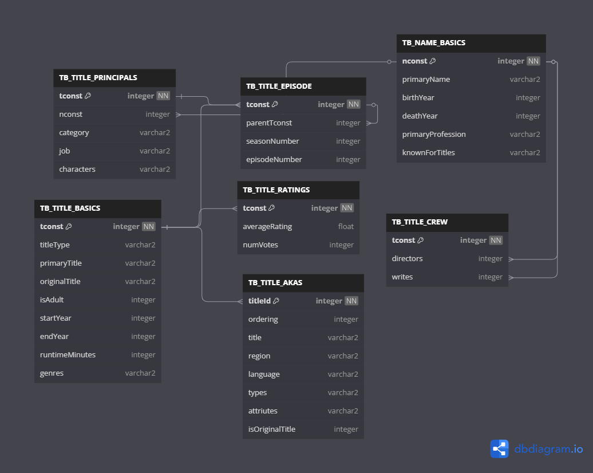
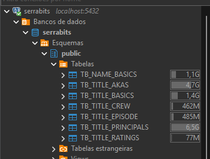
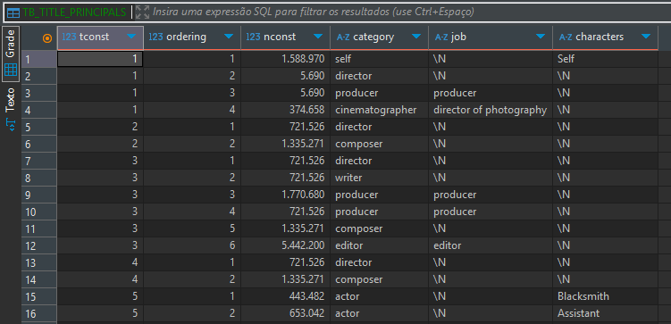
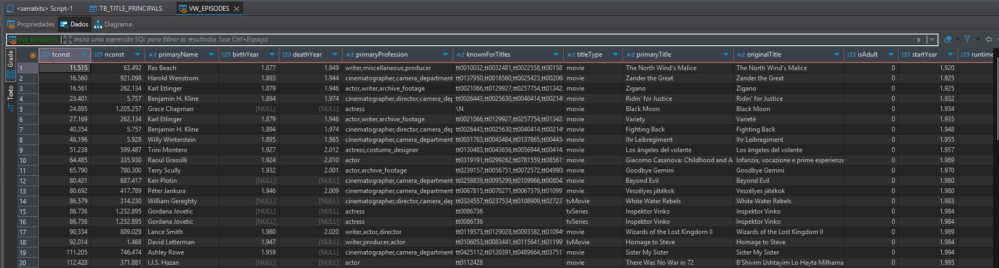
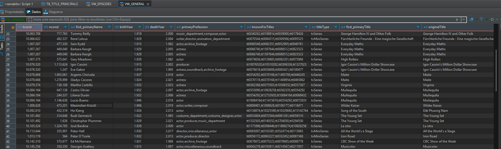
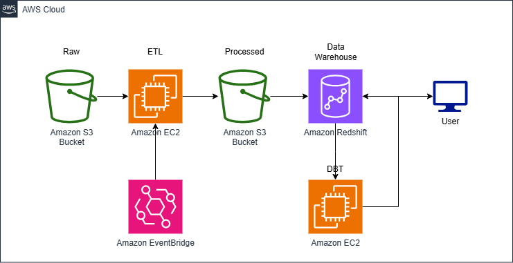
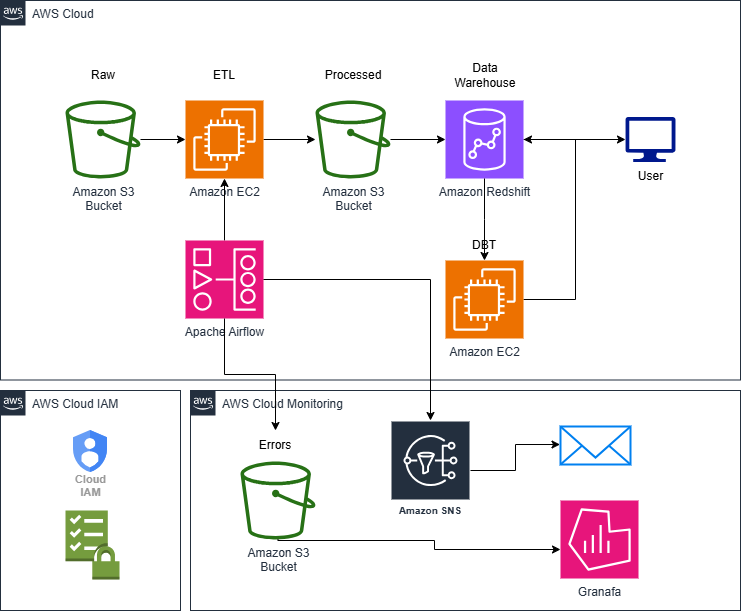

# Projeto de Ingestão de Dados do IMDB

Este projeto é uma implementação de um pipeline de ETL (Extração, Transformação e Carga) utilizando dados do IMDB. O objetivo é fornecer uma base de dados estruturada para análises futuras por cientistas de dados e analistas de dados. A ingestão dos dados é realizada em um banco de dados PostgreSQL, e o DBT (Data Build Tool) é utilizado para a criação de views e linhagem das tabelas.

## Sumário
- Estrutura do Projeto  
- Solução  
- Docker Compose e Containers  
- Como Executar o Projeto  
- Uma pequena olhada nos dados  
- DBT e as Views  
- ETL vs. ELT  
- Data Lake vs. Data Lakehouse vs. Data Warehouse
- Governança e Qualidade de Dados  
- Infraestrutura em Nuvem (AWS)  
- AWS - Baixo custo (Poucos dados e baixa taxa atualização)  
- Solução na AWS - Recomendada (Mais dados em menos tempo)  
- Resumo  

## Estrutura do Projeto

A estrutura do projeto é a seguinte:

```
data_ingestionProject/
├── docker-compose.yml      # Configurações do Docker Compose
├── Dockerfile      # Dockerização do ETL
├── .env                    # Variáveis de ambiente
├── postgres/               
│   └── init.sql           # Script de inicialização do banco de dados
├── notebooks/              
│   └── test.ipynb  # Análise exploratória dos dados
├── src/                   
│   ├── extract.py        # Faz download e extração dos datasets .tsv.gz
│   ├── transform.py       # Limpezas ou transformações adicionais 
│   └── load.py       # Carrega os arquivos no PostgreSQL
├── pyproject.toml        # Dependências do projeto pelo poetry
├── poetry.lock        # poetry lock
├── dbt/                   # Modelos DBT para BI e cientistas
│   ├── models/        # Queries SQL para transformação
│   ├── dbt_project.yml       # Configuração do projeto
│   ├── Dockerfile       # Arquivo de configurações Docker do container
│   └── profiles.yml        # Perfis do banco
└── README.md              # Documentação do projeto
```

## Solução

Como os dados eram estáticos e leves (entre 10gb a 15gb), só havia a necessidade de baixá-los uma vez, portanto, a solução escolhida foi a de fornecer um processo único que sobe, extrai, transforme, ingere no banco e morre. 

As seguintes ferramentas foram utilizadas:
- Para o ETL foi utilizado Python puro;
- A library Poetry foi escolhida para gerenciamento das libs do projeto.
- Os dados eram transformados e inseridos num banco de dados PostgreSQL;
- O DBT era responsável pelo refinamento dos dados e linhagem do SQL;
- O Jupyter servindo para acesso do cientista e analista de dados.

### Docker Compose e Containers

Um arquivo `docker-compose.yml` contêm as especificações de 4 containers que serão inicializados no Docker. São eles:
- **Postgres**: Banco de dados relacional para o recebimento e fornecimento dos dados estruturados;
- **ETL**: Container Python para o processo de ETL;
- **Jupyter**: Possui o jupyter para acesso e criação de notebooks;
- **DBT**: Container com o DBT para gerenciamento das queries e views.

## Como Executar o Projeto

Para executar o projeto, siga os passos abaixo:

1. Clone o repositório:
   ```bash
   git clone <URL_DO_REPOSITORIO>
   cd data_ingestion_project
   ```

2. Configure as variáveis de ambiente no arquivo `.env`.

3. Inicie os containers do Docker:
   ```bash
   docker-compose up
   ```

4. Aguarde o container `container-etl` finalizar o processamento e ingestão dos dados no PostgreSQL e morrer.

5. (Etapa não obrigatória) Acesse o bash do DBT e digite o comando:
   ```
   dbt run
   ```
   Isso irá criar as views que estão salvas no /models. Você poderá acessar os dados diretamente do postgres

5. Acesse o Jupyter Notebook para realizar a análise exploratória:
   ```bash
   http://localhost:8888
   ```
   Ou você pode se conectar ao PostgreSQL pelo DBeaver no
   ```
   localhost:5432
   user: user
   password: pass
   ```

## Uma pequena olhada nos dados

### Diagrama de relacionamentos

Abaixo, segue o diagrama que informa os schemas das tabelas no PostgreSQL. Esses schemas foram construídos com base em análise prévia dos dados. Nem todos os tipos das colunas estão nos formatos originais. Alguns deles foram modificados com o intuito de minimizar a quantidade de armazenamento necessário.

As seguintes transformações foram feitas:
- **Ponto Flutuante -> Inteiro**: Nos casos em que o valor era ponto flutuante mas não utilizava as casas decimais e o casting para integer não acarretaria em perda de informação.
- **Id string -> Inteiro**: Alguns IDs começavam com `tt` ou `nm` e seguiam uma sequencia de inteiros. Os caracteres foram removidos e o valor convertido pra inteiro.
- **Nulos**: Algumas linhas nulas possuiam a string `\\N`. Elas foram substituidas por `null` nas views do DBT.
- **Outras modificações**: Algumas colunas de inteiros ou pontos flutuantes misturavam valores string em algumas linhas devido a má formatação do arquivo. Essas linhas foram anuladas.

Tais modificações garantem uma redução no tamanho de memória de armazenamento necessária no banco. Pontos flutuantes necessitam de mais memória assim como strings. A transformação para inteiro diminui essa quantidade.



Ao final do ETL o PostgreSQL conterá as 7 tabelas que representam os 7 arquivos do site.

Podemos ver as tabelas no Esquema `public` através do DBeaver:



Dando uma pequena olhada na tabela `TB_TITLE_PRINCIPALS`, que é a maior tabela que temos, podemos ver o formato dos dados:



### DBT e as Views

Como o intuito do projeto é fornecer dados para Cientistas e Analistas de Dados, o DBT entra como uma forma de organizar as queries e criar perfis de acesso aos dados de forma personalizada. 

#### Cientista de dados

Para um cientista de dados, talvez, eles precisem conter o máximo de colunas, mesmo que elas sejam nulas pois ele poderá utilizar estatística, machine learning ou qualquer outra ferramenta de engenharia de features para preencher as lacunas e gerar modelos de IA robustos.

Pensando nisso, a view VW_EPISODES foi criada. Ela remove duplicatas, compila várias tabelas em uma só mas não remove os valores nulos.



#### Analista de dados

Como normalmente o intuito do Analista de Dados é a construção de gráficos e dashboards, os eles precisam estar mais limpos com menos valores nulos e muitas vezes eles não precisam estar todos em uma tabela só. Por vezes é necessário agrupar alguns dados em poucas tabelas de forma limpa e organizada.

Pensando nisso, uma view VW_GENERAL foi criada. Remoção de duplicatas, remoção de valores nulos e algumas tabelas foram unidas.



## ETL vs. ELT

O processo de ETL foi escolhido pois os dados do IMDB no formato `.tsv` precisavam de pequenos ajustes para serem inseridos em um banco de dados relacional. O intuito foi de preservar os dados em sua essência evitando a remoção de linhas ou trocas de valores que pudesse causar perda de informação. 

Contudo, para o melhor desempenho do banco e diminuição da volumetria dos dados, fora feitas as seguintes transformações:
- Remoção dos `tt` e `nm` dos ids e string -> inteiro.
- Valores em ponto flutuante que podiam ser transformados em inteiro sem perda de informação foram alterados.
- Remoção de strings em colunas de inteiros ou pontos flutuantes para forçar os dados a entrarem no schema da tabela.

As outras transformações ficaram na ponta sob responsabilidade do DBT que efetua a limpeza dos dados conforme a necessidade do consumidor final, no caso, o cientista de dados e o analista de dados.

#### Por que não usei o ELT?

O ELT é mais usado em casos onde gostaria de se preservar 100% dos dados crus. Normalmente funcionam em **Data Lakes**. Como nossos dados são estruturados (`.tsv`) e necessitavam de transformações para serem inseridos no BD, a melhor solução seria a de criação de um **Data Warehouse** através de um ETL.

## Data Lake vs. Data Lakehouse vs. Data Warehouse

Como dito anteriormente, o projeto consiste em uma pequena quantidade de dados que serão utilizados por cientistas e analistas de dados. Nesse caso, a melhor forma de utilizá-los seria através de queries em um banco de dados pois não há variação nos formatos (`.tsv`, `.csv`, `.xls`, etc) dos arquivos. 

Caso houvessem várias fontes de dados, precisaríamos adaptar o projeto para recebê-los e fornecê-los, além da necessidade de utilizar ferramentas de Data Warehouse como **BigQuery** da GCP, **Redshift** da AWS ou **Snowflake** por exemplo.

## Governança e Qualidade de Dados

No contexto de governança e qualidade de dados, algumas medidas podeiram ser tomadas no caso de haver um fluxo de dados contínuo. Seriam elas:
- **Automação de Agendamento e Orquestração**: Implementar um sistema de orquestração (ex: **Airflow**) para executar o pipeline de ETL em intervalos regulares.
- **Monitoramento**: Adicionar monitoração ao pipeline para rastrear falhas e desempenho.
- **Testes de Dados**: Implementar testes de qualidade dos dados para garantir a integridade e precisão dos dados carregados.
- **Documentação do DBT**: Expandir a documentação e a linhagem dos dados utilizando as funcionalidades do DBT.
- **Visão geral dos dados**: Utilizar uma ferramenta como o **DataHub** para classificação dos dados ajuda os times a saberem os dados que a empresa possuem e onde podem localizá-lo.

## Infraestrutura em Nuvem (AWS)

Apesar da construção da solução ter sido local, trago algumas possíveis soluções em nuvem (AWS) que poderiam ser aplicadas dependendo do cenário de recebimento e fornecimento dos dados.

Considerando que, no lugar dos dados estáticos recebessemos uma atualização diária através de uma API ou websocket, poderiamos ter as seguintes soluções com os pontos negativos e positivos.

### AWS - Baixo custo (Poucos dados e baixa taxa atualização)



Nessa versão de solução, podemos utilizar poucos serviços da AWS abaixando o custo.

Como os dados são em batch (lote), é possível utilizar o EventBridge para triggar uma VM no EC2 com o script de extração, transformação e carregamento dos dados no data warehouse que serão lidos pelo `Amazon Redshift` fornecendo um meio de acesso aos consumidores.

Como funciona essa solução:

1. O EventBridge é programado para triggar a instância `EC2` em determinado horário do dia
2. A instância é iniciada com Python puro e começa o processo de extração dos dados salvando no bucket `Raw`, depois é feita a transformação e a inserção dos dados no bucket `Processed`;
3. Esses dados são lidos pelo `Amazon Redshift`;
4. O `DBT` em outra instância do `EC2` faz o processo de refinamento das views e views materializadas e organização das queries.
5. O consumidor final requisita os dados a partir do Redshift com SQL.

### Pontos Positivos

- **Custo Reduzido**: Utilização de poucos serviços da AWS ajuda a manter os custos baixos, especialmente se os serviços são executados apenas em horários programados.

- **Simplicidade**: A arquitetura é relativamente simples e fácil de entender, o que facilita a implementação e a manutenção.

- **Flexibilidade com EC2**: A utilização de instâncias EC2 permite personalização total do ambiente e dos scripts de ETL, podendo ser facilmente adaptado conforme as necessidades.

- **Integração com Redshift**: O uso do Amazon Redshift para consulta dos dados oferece uma solução robusta para análises de grandes volumes de dados.

- **Uso do DBT**: A utilização do DBT para modelagem e transformação de dados oferece uma maneira organizada e eficiente de gerenciar a lógica de transformação.

### Pontos Negativos

- **Falta de Orquestração**: A ausência de um orquestrador como o Airflow dificulta o monitoramento e a gestão dos pipelines, tornando a identificação de falhas e a correção de erros mais desafiadora.

- **Dependência de EC2**: A necessidade de manter instâncias EC2 rodando pode levar a custos adicionais se não forem geridas corretamente (por exemplo, instâncias não utilizadas permanecendo ativas).

- **Escalabilidade Limitada**: Embora funcione bem para cargas de trabalho moderadas, a arquitetura pode enfrentar desafios em termos de escalabilidade conforme o volume de dados aumenta.

- **Gerenciamento Manual**: A configuração e o gerenciamento das instâncias EC2, bem como a execução manual dos scripts, podem ser propensos a erros humanos e podem demandar mais tempo.

- **Complexidade na Transformação de Dados**: Dependendo da complexidade das transformações necessárias, o uso de Python puro pode levar a um aumento no tempo de desenvolvimento e manutenção.

- **Monitoramento e Alertas**: Sem uma solução de monitoramento integrada, pode ser difícil identificar problemas rapidamente, o que pode impactar a confiança nos dados.

## Solução na AWS - Recomendada (Mais dados em menos tempo)



Nesta solução, uma camada de orquestração e monitoramento foi adicionada. O Apache Airflow entra para gerenciar as tasks de pipeline fornecendo logs do eventos e alertando via email através do Amazon SNS os responsáveis pelo gerenciamento deles. O monitoramento das execuções pode ser acompanhado diretamente pelo Grafana.

### Pontos Positivos

- **Orquestração Eficiente**: O uso do Apache Airflow permite a automação e o gerenciamento de workflows complexos, facilitando o monitoramento e a execução de tarefas ETL de forma eficiente.

- **Separação de Camadas**: A arquitetura tem uma clara separação entre os dados brutos (`Raw`), processados (`Processed`) e o data warehouse (`Redshift`), o que proporciona melhor controle sobre a qualidade e a integridade dos dados.

- **Escalabilidade**: A utilização de serviços da AWS, como EC2 e S3, permite que a solução seja escalável. Você pode aumentar ou diminuir os recursos conforme necessário, conforme a demanda de processamento de dados.

- **Notificações em Caso de Erros**: A integração com o Amazon SNS para notificações torna a solução proativa em relação à monitorização, permitindo que os administradores sejam alertados rapidamente sobre problemas.

- **Flexibilidade de Processamento**: Com a arquitetura, é possível executar transformações complexas usando o DBT e manter a lógica de transformação de dados organizada.

- **Monitoramento**: O uso do AWS Cloud Monitoring e a capacidade de gravar logs em um bucket S3 facilitam a auditoria e a análise de problemas, além de permitir um monitoramento contínuo da performance da solução.

### Pontos Negativos

- **Complexidade da Configuração**: A configuração inicial de todos os componentes (Airflow, EC2, Redshift, SNS) pode ser complexa e exigir um tempo de implementação maior.

- **Custo Potencial**: Embora o custo possa ser otimizado, o uso de múltiplos serviços AWS (EC2, Redshift, S3, SNS) pode resultar em despesas significativas, especialmente se não houver um monitoramento adequado dos recursos.

- **Dependência de Várias Tecnologias**: A dependência de múltiplos serviços e tecnologias pode aumentar a complexidade da solução, tornando mais difícil o diagnóstico e a manutenção de problemas.

- **Gerenciamento de Recursos**: A necessidade de gerenciar instâncias EC2 e monitorar sua performance pode ser um desafio, especialmente em ambientes de produção.

- **Latência Potencial**: Dependendo de como os ETL e as consultas são executados, pode haver latência na atualização dos dados, o que pode ser um problema para aplicações que requerem dados em tempo real.

- **Resiliência e Redundância**: A arquitetura deve ser projetada com resiliência em mente. Se um componente falhar (como a instância EC2), isso pode impactar todo o fluxo de dados, a menos que haja redundância adequada.

## Resumo

### O que foi feito

1. **Extração dos dados**: O script `extract.py` faz o download e a extração dos datasets do IMDB no formato `.tsv.gz`.
2. **Transformações adicionais**: O script `transform.py` realiza limpezas ou transformações adicionais nos dados, preparando-os para análises.
3. **Ingestão dos dados**: O script `load.py` carrega os dados extraídos no banco de dados PostgreSQL.
4. **Modelagem com DBT**: O diretório `dbt/` contém modelos que podem ser utilizados para criar views e facilitar a análise de dados.
5. **Análise exploratória**: Um Jupyter Notebook (`test.ipynb`) foi criado para explorar os dados e apresentar insights iniciais.